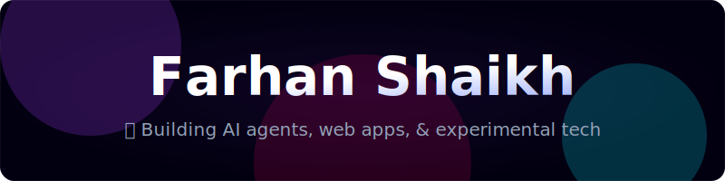

  <!-- Custom Neon Animated SVG matching the user's Portfolio Theme -->
  

  <h3>Leveling up in coding and gaming 🚀</h3>
  
  

    <b>I'm currently working on AI agents, web apps, and experimental projects using modern APIs and automation tools!</b>
  

   

  <!-- Interactive Premium Socials via SkillIcons -->
  
  
  
  
  

  

## 📊 Dynamic Activity & Metrics
> *The elements below are individually generated animated GIFs/SVGs via GitHub Actions. If you see broken links, the automated workflow is currently generating them!*

<table width="100%">
  <tr>
    <td width="50%" align="center">
      <h3>⭐ GitHub Core Stats</h3>
      
    </td>
    <td width="50%" align="center">
      <h3>💻 Language Distribution</h3>
      
    </td>
  </tr>
</table>

### 📅 Contribution Calendar

  

 

### 🐍 Animated Contribution Snake (Cyber Theme)

  <picture>
    <source media="(prefers-color-scheme: dark)" srcset="github-snake-dark.svg">
    <source media="(prefers-color-scheme: light)" srcset="github-snake.svg">
    
  </picture>

 

<table width="100%">
  <tr>
    <td width="50%" align="center">
      <h3>🚀 Coding Habits</h3>
      
    </td>
    <td width="50%" align="center">
      <h3>🔥 Open Source Streak</h3>
       
      
    </td>
  </tr>
</table>

  

## 🛠️ Tech Stack & Arsenal

  
<b>🌐 Languages & Core Tech</b>

   
  

    
  

  
<b>💻 Frameworks & Libraries</b>

   
  

    
  

  
<b>🗄️ Database & Cloud</b>

   
  

    
  

  
<b>🤖 AI & Data Science</b>

   
  

    
    
    
    
  

  

